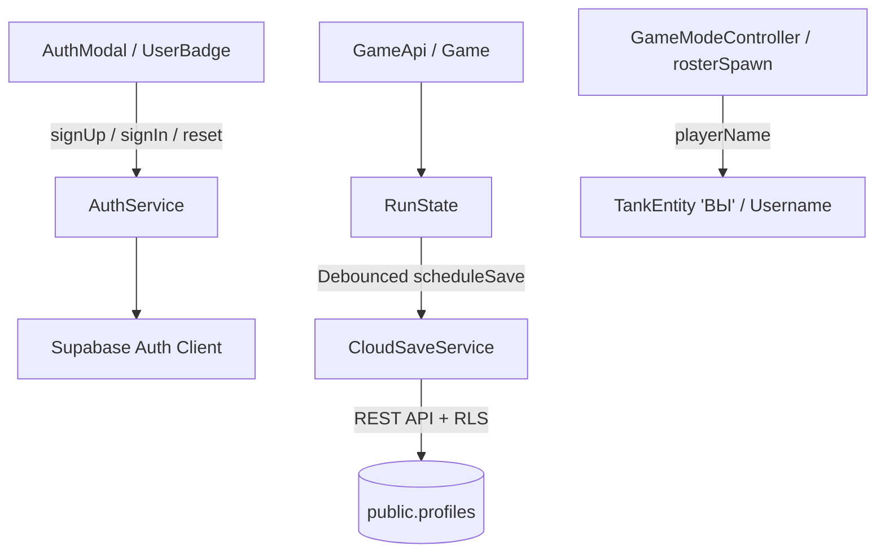

# GDD — Облачные профили и аутентификация (Cloud Profiles & Auth)

Система учетных записей игроков, аутентификации через Supabase (PostgreSQL + Auth + RLS) и двухсторонней синхронизации игрового прогресса между локальным рантаймом (`RunState`) и облачной базой данных.

---

## 1. Концепция и UX

### Гостевой режим (Guest First)
- Любой новый игрок сразу начинает игру в статусе **«Гость»** без необходимости обязательной регистрации.
- Локальный прогресс (кредиты, открытые корпуса, башни, стартовый комплект и задачи) сохраняется в `localStorage` (`as2_loadout`).
- В правом верхнем углу меню и гаража отображается виджет `UserBadge`: `[ 👤 ГОСТЬ | ВОЙТИ ]`.

### Регистрация
- Поля: **Имя пользователя (`username`)**, **Email**, **Пароль** и **Повтор пароля**.
- **Email Confirmation = OFF**: подтверждение почты отключено (через настройки Gotrue и Postgres-триггер `auto_confirm_user`). Пользователь авторизуется мгновенно.
- **Бесшовная миграция**: при первой регистрации текущий прогресс гостя из `RunState` автоматически передаётся в метаданные регистрации и записывается в созданный профиль в таблице `public.profiles`.

### Вход (Login)
- Единое поле ввода: **Email или Username** + **Пароль**.
- Если введён `username` (строка без символа `@`), клиент вызывает безопасную RPC-функцию `get_email_by_username(p_username)` для резолва email перед вызовом `signInWithPassword`.

### Восстановление доступа (Сброс пароля)
- Кнопка «Забыли пароль?»: ввод `username` или `email` → отправка письма с одноразовой ссылкой (`resetPasswordForEmail`).
- При переходе по ссылке игра перехватывает событие `PASSWORD_RECOVERY` и открывает модальное окно установки нового пароля (`updateUser({ password })`).

---

## 2. Схема базы данных (PostgreSQL)

### Таблица `public.profiles`
| Колонка | Тип | Ограничения / Описание |
|---|---|---|
| `id` | `uuid` | `PRIMARY KEY REFERENCES auth.users(id) ON DELETE CASCADE` |
| `username` | `text` | `NOT NULL UNIQUE`, длина 3–20 символов, регистронезависимый индекс |
| `credits` | `integer` | `NOT NULL DEFAULT 0 CHECK (credits >= 0)` |
| `unlocked_hulls` | `text[]` | `NOT NULL DEFAULT array['hunter']` |
| `unlocked_turrets` | `text[]` | `NOT NULL DEFAULT array['railgun']` |
| `current_hull` | `text` | `NOT NULL DEFAULT 'hunter'` |
| `current_turret` | `text` | `NOT NULL DEFAULT 'railgun'` |
| `starter_pack_claimed` | `boolean` | `NOT NULL DEFAULT false` |
| `quests` | `jsonb` | `NOT NULL DEFAULT '[]'::jsonb` |
| `stats` | `jsonb` | `NOT NULL DEFAULT '{"kills":0,"deaths":0,"score":0,"matches":0}'::jsonb` |
| `created_at` | `timestamptz`| `DEFAULT now()` |
| `updated_at` | `timestamptz`| `DEFAULT now()` |

### Row Level Security (RLS)
1. `profiles_select_policy`: `SELECT` разрешён для ролей `authenticated` и `anon` (для отображения никнеймов в матчах, скорбордах и таблицах лидеров).
2. `profiles_update_policy`: `UPDATE` разрешён только владельцу строки: `(select auth.uid()) = id` (с аналогичной проверкой в `WITH CHECK`).
3. `profiles_insert_policy`: `INSERT` разрешён для `(select auth.uid()) = id`.

### Функции и триггеры
1. `handle_new_user()` (`AFTER INSERT ON auth.users`):
   - Автоматически создаёт строку в `public.profiles` на основе `raw_user_meta_data`.
   - Поддерживает перенос стартового инвентаря и кредитов гостя.
2. `auto_confirm_user()` (`BEFORE INSERT ON auth.users`):
   - Автоматически выставляет `new.email_confirmed_at = coalesce(new.email_confirmed_at, now())`.
3. `get_email_by_username(p_username text)`:
   - `SECURITY DEFINER` функция с `SET search_path = public, auth`.
   - Доступна для `anon` и `authenticated` для обеспечения входа по никнейму.

---

## 3. Архитектура клиента

- **`src/lib/supabaseClient.ts`**: синглтон Supabase клиента с авто-обновлением токенов и детекцией сессий в URL.
- **`src/game/auth/authService.ts`**: методы авторизации, валидация полей (длина никнейма, regex, пароль >= 6 символов, email regex), подписка на `onAuthStateChange`.
- **`src/game/auth/cloudSaveService.ts`**: асинхронная загрузка и сохранение профиля с дебаунсом 500 мс для защиты от сетевого спама при покупках/квестах.
- **`src/components/auth/AuthModal.tsx`**: модальное окно авторизации/регистрации/сброса пароля в едином дизайне HUD без Tailwind rounded.
- **`src/components/auth/UserBadge.tsx`**: бейдж статуса игрока в шапке меню и гаража с индикацией облачной синхронизации.
