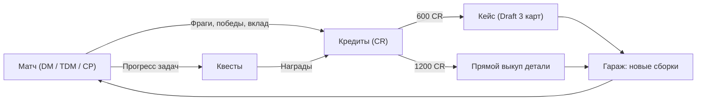

# Экономика, боевые награды и система квестов (Economy, Rewards & Quests)

**Статус:** Approved  
**Дата:** 2026-09-18  
**Код:** `src/game/economy/matchRewards.ts`, `src/game/economy/questCatalog.ts`, `src/game/RunState.ts`, `src/game/GameApi.ts`, `src/game/Game.ts`, `src/components/QuestsModal.tsx`, `src/components/CrateOpeningModal.tsx`, `src/components/DirectUnlockModal.tsx`, `src/components/GameOverScreen.tsx`

---

## 1. Intent (Назначение и цели)

Мета-петля (Core Meta Loop) связывает матчи, экономику и разблокировку вооружения:
1. **Материальная награда за каждый бой:** игрок зарабатывает внутриигровую валюту — Кредиты (⚙️ CR) — за участие, фраги, очки скора, победу и серию убийств.
2. **Боевые задачи (квесты / контракты):** постоянный поток из 3 активных заданий с ротацией, поощряющий различные стили игры и режимы.
3. **Разблокировка закрытого арсенала:** заработанные кредиты тратятся в Гараже на контейнеры со случайным выбором (600 CR за драфт из 3 карт) либо на прямой выкуп конкретного корпуса/башни (1200 CR).

---

## 2. Формула наград за матч (Match Payout)

Расчёт производится в `calculateMatchRewards` (`src/game/economy/matchRewards.ts`):

$$\text{Итоговые CR} = \text{CR}_{\text{базовые}} + \text{CR}_{\text{фраги}} + \text{CR}_{\text{счёт}} + \text{CR}_{\text{исход}} + \text{CR}_{\text{стрик}}$$

1. **Базовое участие ($\text{CR}_{\text{базовые}}$):** 50 CR за завершение раунда.
2. **Фраги ($\text{CR}_{\text{фраги}}$):** 20 CR за каждое убийство (`kills * 20`).
3. **Очки XP ($\text{CR}_{\text{счёт}}$):** 1 CR за каждые 10 очков (`Math.floor(score / 10)`).
4. **Бонус за исход ($\text{CR}_{\text{исход}}$):**
   - Победа: +100 CR.
   - Ничья: +40 CR.
   - Поражение: 0 CR.
5. **Серия убийств ($\text{CR}_{\text{стрик}}$):** `bestStreak * 15` CR.

Квитанция наград с детализацией каждого компонента отображается на экране `GameOverScreen`.

---

## 3. Система квестов (Quests System)

### Структура и каталог (`src/game/economy/questCatalog.ts`)
Игроку доступно 3 слота активных задач. При получении награды слот мгновенно заполняется новой задачей из общего каталога (`rollNextQuest`):
- `q_kills_5` — Уничтожить 5 танков (200 CR).
- `q_kills_10` — Уничтожить 10 танков (350 CR).
- `q_matches_2` — Завершить 2 матча (150 CR).
- `q_matches_4` — Завершить 4 матча (300 CR).
- `q_win_any` — Одержать 1 победу в любом режиме (250 CR).
- `q_win_tdm` — Одержать 1 победу в режиме TDM (300 CR).
- `q_cp_capture_3` — Захватить 3 точки в режиме CP (300 CR).
- `q_streak_3` — Совершить серию из 3 убийств (250 CR).
- `q_streak_5` — Совершить серию из 5 убийств (400 CR).

Интерфейс задач доступен через диалоговое окно `QuestsModal` из Главного меню, Гаража и экрана результатов матча.

---

## 4. Магазин и разблокировка в Гараже

- **Кейс корпуса / башни (600 CR):** открывает диалог `CrateOpeningModal` с драфтом из 3 случайных неразблокированных вариантов соответствующего типа.
- **Прямой выкуп (1200 CR):** открывает диалог `DirectUnlockModal` с возможностью гарантированно выбрать и разблокировать конкретную деталь.
- Состояние инвентаря и баланса персистентно сохраняется в `localStorage` ключ `as2_loadout`.
